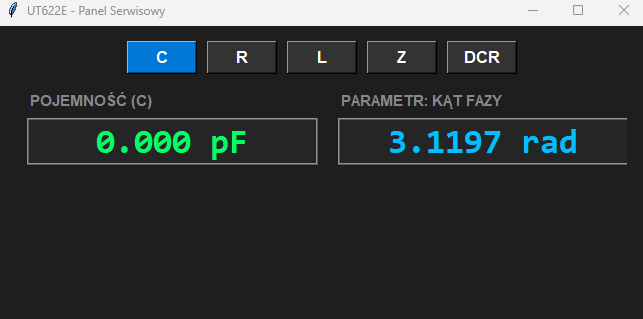
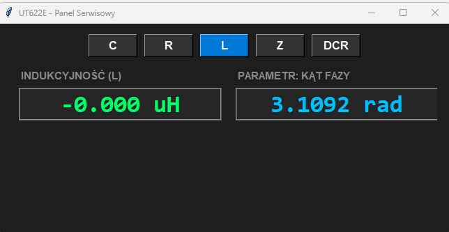
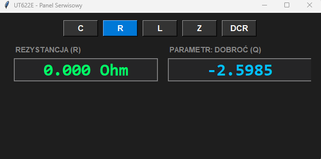

# UT622E - LCR Service Panel (GUI for OBS / Stream Deck)

A Python-based graphical user interface (Tkinter) designed to fetch real-time measurement data from the professional **UNI-T UT622E** LCR meter via a serial port (USB-RS232). 

This project was built specifically for **live streaming (OBS Studio)** and **Stream Deck** integration. Instead of squinting at the meter's small built-in display or managing a raw command-line terminal, you get massive, high-contrast, color-coded digits perfectly legible on your bench repair videos and live streams.

---

## 🚀 Key Features

* **Automatic Engineering Unit Scaling:** Full support for pico-, nano-, and micro-farads (pF, nF, uF) with built-in tolerance for negative open-probe calibration noise.
* **All Measurement Modes Supported:** Quickly switch display layouts using dedicated on-screen buttons: `C` (Capacitance), `R` (Resistance), `L` (Inductance), `Z` (Impedance), and `DCR` (DC Resistance).
* **Smart Secondary Parameter Labeling:** Automatically detects and displays secondary values such as Quality Factor (Q), Dissipation Factor (D), Phase Angle (deg/rad), and ESR / Reactance (X).
* **Stream-Ready High Contrast UI:** Features a sleek dark theme (`#1e1e1e`) with vibrant neon green and cyan text, optimized for OBS Window Capture and clean cropping.
* **Stream Deck Native Layout:** Easily packages into a standalone `.exe` file to launch silently with a single physical keypress.

---

## 📦 Getting Started

### Requirements:
* Python 3.x
* `pyserial` library (for COM port communication)

### Dependencies Installation:

pip install pyserial

    

   

